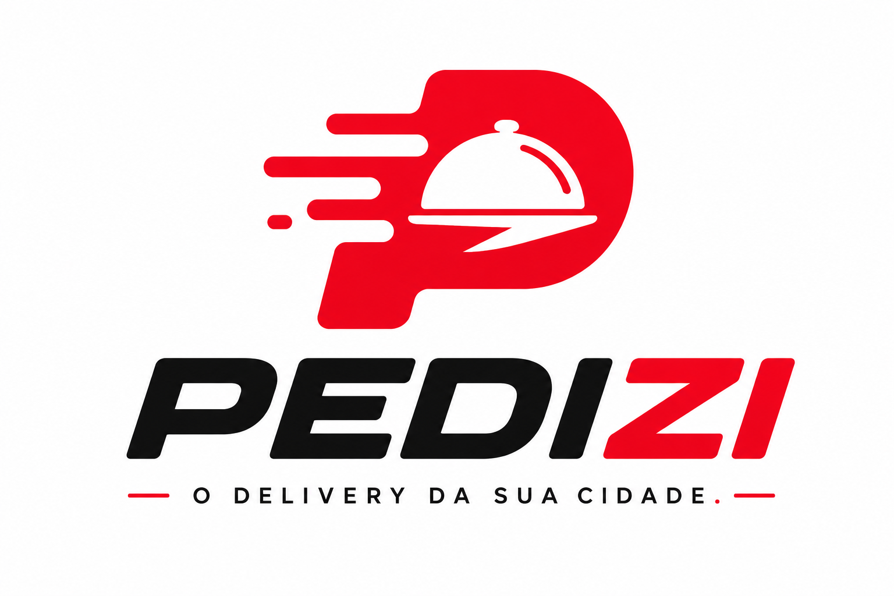

<div align="center">



<br/>
<br/>

**Plataforma SaaS de Delivery para Cidades do Interior do Brasil**

<br/>

[](https://nodejs.org)
[](https://nestjs.com)
[](https://nextjs.org)
[](https://www.typescriptlang.org)
[](https://www.postgresql.org)
[](https://redis.io)
[](https://docker.com)
[](LICENSE)

<br/>

[🚀 Início Rápido](#-início-rápido) •
[📖 Documentação](#-documentação-da-api) •
[🏗️ Arquitetura](#️-arquitetura) •
[🌐 Deploy](#-deploy-em-produção) •
[🗺️ Roadmap](#️-roadmap)

</div>

---

## O que é o PEDIZI?

O **PEDIZI** é um marketplace de delivery completo — como o iFood, mas pensado para **cidades pequenas e o interior do Brasil**, com:

- ✅ Taxas menores para os restaurantes
- ✅ Relacionamento próximo com comerciantes locais
- ✅ Suporte rápido e humanizado
- ✅ Tecnologia de ponta acessível a qualquer cidade

A plataforma permite que **lanchonetes, pizzarias, hamburguerias, restaurantes, açaíterias e marmitarias** cadastrem cardápios, recebam pedidos, aceitem pagamentos via PIX e gerenciem entregas — tudo em tempo real.

---

## 🗂️ Estrutura do Monorepo

```
pedizi/
├── apps/
│   ├── api/            ← Backend NestJS          (porta 3333)
│   ├── web/            ← App do Cliente Next.js   (porta 3000)
│   ├── admin/          ← Dashboard Admin Next.js  (porta 3001)
│   └── restaurant/     ← Painel Restaurante        (porta 3002)
│
├── packages/
│   ├── types/          ← Tipos TypeScript compartilhados
│   ├── ui/             ← Design System PEDIZI
│   └── config/         ← ESLint + TypeScript configs
│
├── infra/
│   ├── nginx/          ← Reverse proxy + SSL
│   └── postgres/       ← Scripts de inicialização
│
├── scripts/
│   ├── setup.ps1       ← Setup automático (Windows)
│   └── setup.sh        ← Setup automático (Linux/Mac)
│
├── img/
│   └── logo.png        ← Logo oficial PEDIZI
│
├── docker-compose.yml      ← Produção (todos os serviços)
├── docker-compose.dev.yml  ← Desenvolvimento (banco + redis)
├── DEPLOY.md               ← Guia completo de produção
└── turbo.json
```

---

## 🚀 Início Rápido

### Pré-requisitos

| Ferramenta | Versão Mínima |
|-----------|--------------|
| Node.js | >= 20 |
| pnpm | >= 9 |
| Docker | Qualquer versão recente |
| Git | Qualquer versão recente |

### Setup Automático (recomendado)

**Windows (PowerShell):**
```powershell
.\scripts\setup.ps1
```

**Linux / Mac:**
```bash
bash scripts/setup.sh
```

O script faz tudo automaticamente: instala dependências, sobe o banco de dados, roda as migrations e popula com dados de exemplo.

---

### Setup Manual

```bash
# 1. Instalar dependências
pnpm install

# 2. Subir banco de dados e Redis (Docker)
docker compose -f docker-compose.dev.yml up -d

# 3. Configurar variáveis de ambiente
cp apps/api/.env.production.example apps/api/.env
# Edite apps/api/.env com suas configurações

# 4. Criar tabelas no banco
pnpm db:generate
pnpm db:migrate

# 5. Popular com dados de exemplo
pnpm db:seed

# 6. Iniciar todos os apps
pnpm dev
```

### Apps disponíveis após o `pnpm dev`

| App | URL | Descrição |
|-----|-----|-----------|
| 📱 Cliente | http://localhost:3000 | App de pedidos para o cliente final |
| 🖥️ Admin | http://localhost:3001 | Dashboard global da plataforma |
| 🍔 Restaurante | http://localhost:3002 | Painel de gestão do estabelecimento |
| 🔧 API | http://localhost:3333 | Backend NestJS |
| 📚 Swagger | http://localhost:3333/api/docs | Documentação interativa da API |

---

## 🔑 Credenciais de Teste

> Disponíveis após rodar `pnpm db:seed`

| Perfil | E-mail | Senha |
|--------|--------|-------|
| 👑 Admin | admin@pedizi.com.br | Admin@123 |
| 👤 Cliente | joao@teste.com | Cliente@123 |
| 🍔 Restaurante | dono@burguerhouse.com | Owner@123 |

**Cupom de teste:** `PEDIZI10` — 10% de desconto (mínimo R$ 30)

---

## 🏗️ Arquitetura

```
                    ┌──────────────────────────────────┐
                    │         Cloudflare DNS            │
                    │   pedizi.com.br → Vercel (web)   │
                    │   admin.pedizi.com.br → Vercel   │
                    │   api.pedizi.com.br → Railway    │
                    └──────────────────────────────────┘
                              │            │
                    ┌─────────▼────┐ ┌─────▼──────────┐
                    │    Vercel    │ │    Railway      │
                    │  (3 Next.js) │ │   NestJS API    │
                    └─────────────┘ └────────┬────────┘
                                             │
                    ┌───────────┬────────────┼──────────────┐
                    │           │            │              │
             ┌──────▼──────┐ ┌──▼──────┐ ┌──▼─────────┐ ┌──▼────────┐
             │  Supabase   │ │Upstash  │ │Cloudinary  │ │ Mercado   │
             │ PostgreSQL  │ │ Redis   │ │  Imagens   │ │   Pago    │
             └─────────────┘ └─────────┘ └────────────┘ └───────────┘
```

### Módulos do Backend (Clean Architecture)

| Módulo | Responsabilidade |
|--------|-----------------|
| `auth` | JWT, refresh tokens, OAuth Google |
| `users` | Perfis, endereços, favoritos |
| `restaurants` | Cadastro, status, dashboard |
| `menu` | Categorias, itens, variações, adicionais |
| `orders` | Criação, rastreamento, histórico |
| `payments` | PIX Mercado Pago, webhooks, estornos |
| `delivery` | Entregadores, localização GPS realtime |
| `notifications` | Push realtime via Socket.IO |
| `coupons` | Cupons por valor, percentual ou frete grátis |
| `reviews` | Avaliações de restaurantes e entregadores |
| `analytics` | KPIs, receita, ranking, gráficos |
| `subscriptions` | Planos SaaS dos restaurantes |
| `admin` | Gestão global, aprovações, financeiro |
| `upload` | Cloudinary com otimização automática |

---

## 🛠️ Stack Tecnológica

<table>
<tr>
<td valign="top" width="50%">

**Backend**
- NestJS 11 + TypeScript
- Clean Architecture + SOLID
- Prisma ORM + PostgreSQL
- Redis (Upstash) — cache e sessões
- Socket.IO — realtime
- Mercado Pago — PIX
- Cloudinary — uploads
- Swagger — documentação
- JWT + Refresh Tokens + RBAC

</td>
<td valign="top" width="50%">

**Frontend**
- Next.js 16 App Router
- TypeScript
- TailwindCSS v4
- Framer Motion — animações
- Zustand — estado global
- React Query — cache/fetch
- Socket.IO Client — realtime
- Lucide Icons
- Recharts — gráficos

</td>
</tr>
<tr>
<td valign="top">

**Infraestrutura**
- Docker + Docker Compose
- Turborepo + pnpm Workspaces
- Nginx — reverse proxy + SSL
- GitHub Actions — CI/CD
- Railway — backend
- Vercel — frontends
- Cloudflare — DNS

</td>
<td valign="top">

**Qualidade**
- ESLint + Prettier
- Husky + Commitlint
- Conventional Commits
- Jest — testes unitários
- TypeScript strict mode
- Health checks
- Logs estruturados

</td>
</tr>
</table>

---

## 📡 Documentação da API

Swagger disponível em: **http://localhost:3333/api/docs**

```bash
# Autenticação
POST   /api/v1/auth/register        # Cadastro de usuário
POST   /api/v1/auth/login           # Login
POST   /api/v1/auth/refresh         # Renovar token
GET    /api/v1/auth/google          # Login com Google

# Restaurantes
GET    /api/v1/restaurants          # Listar próximos
GET    /api/v1/restaurants/:id      # Detalhes
GET    /api/v1/restaurants/slug/:slug
GET    /api/v1/restaurants/:id/menu # Cardápio completo

# Pedidos
POST   /api/v1/orders               # Criar pedido
GET    /api/v1/orders/my            # Meus pedidos
GET    /api/v1/orders/:id           # Detalhes do pedido
PATCH  /api/v1/orders/:id/status    # Atualizar status

# Pagamentos
POST   /api/v1/payments/pix         # Gerar QR Code PIX
GET    /api/v1/payments/order/:id   # Status do pagamento
POST   /api/v1/payments/webhooks/mercadopago

# Cupons
GET    /api/v1/coupons/validate     # Validar cupom

# Analytics (Admin)
GET    /api/v1/analytics/admin/dashboard
GET    /api/v1/analytics/admin/revenue
GET    /api/v1/analytics/admin/top-restaurants

# Healthcheck
GET    /api/v1/health
```

---

## 💳 Planos de Assinatura

| Plano | Preço/mês | Comissão | Produtos | Pedidos |
|-------|-----------|----------|----------|---------|
| 🆓 Gratuito | R$ 0 | 18% | 10 | 50 |
| 🚀 Starter | R$ 99,90 | 14% | 50 | 500 |
| ⭐ Profissional | R$ 249,90 | 12% | 200 | 2.000 |
| 🏢 Enterprise | R$ 599,90 | 8% | Ilimitado | Ilimitado |

---

## 🐳 Docker

```bash
# Apenas infraestrutura (dev local)
docker compose -f docker-compose.dev.yml up -d

# Produção completa (todos os serviços)
docker compose up -d --build

# Ver logs em tempo real
docker compose logs -f api

# Parar tudo
docker compose down

# Resetar volumes (apaga dados!)
docker compose down -v
```

---

## 🔐 Segurança

- **JWT** com refresh tokens de rotação automática
- **RBAC** — controle de acesso por perfil (cliente, dono, entregador, admin)
- **Rate limiting** em 3 camadas (curto, médio e longo prazo)
- **Helmet** — cabeçalhos HTTP de segurança
- **bcrypt** — hash de senhas com salt
- **CORS** configurado por domínio
- **Validação** de webhook do Mercado Pago com HMAC-SHA256
- **LGPD ready** — dados de usuário protegidos

---

## 🌐 Deploy em Produção

Consulte o guia completo em **[DEPLOY.md](DEPLOY.md)**.

**Resumo:**

| Serviço | Plataforma | Custo |
|---------|-----------|-------|
| Banco de Dados | Supabase | Grátis |
| Redis | Upstash | Grátis |
| Imagens | Cloudinary | Grátis |
| Backend (API) | Railway | ~$5/mês |
| Frontends (3) | Vercel | Grátis |
| DNS | Cloudflare | Grátis |
| **Total** | | **~$0–5/mês** |

---

## 🗺️ Roadmap

**Versão 1 — Atual ✅**
- [x] Marketplace web para clientes
- [x] Painel de gestão do restaurante
- [x] Dashboard administrativo
- [x] Pagamento PIX (Mercado Pago)
- [x] Pedidos e notificações em tempo real (Socket.IO)
- [x] Rastreamento de entregadores
- [x] Sistema de cupons
- [x] Avaliações
- [x] Analytics e KPIs
- [x] Deploy cloud (Vercel + Railway + Supabase)

**Versão 2 — Em breve**
- [ ] App React Native (iOS + Android) para clientes
- [ ] App React Native para entregadores
- [ ] Rastreamento GPS no mapa (Google Maps)
- [ ] Notificações push (FCM)
- [ ] Multi-idioma (pt-BR, en, es)

**Versão 3 — Futuro**
- [ ] IA de recomendação de pratos
- [ ] ERP integrado para restaurantes
- [ ] Programa de fidelidade
- [ ] Multi-filial por restaurante
- [ ] Assinaturas premium para clientes
- [ ] Migração para microserviços + Kubernetes

---

## 🤝 Contribuindo

```bash
# 1. Fork o repositório
# 2. Criar branch
git checkout -b feat/minha-feature

# 3. Fazer as alterações e commit
git commit -m "feat: adicionar minha funcionalidade"

# 4. Push e Pull Request
git push origin feat/minha-feature
```

**Padrão de commits:** [Conventional Commits](https://www.conventionalcommits.org/pt-br/)

| Prefixo | Quando usar |
|---------|-------------|
| `feat:` | Nova funcionalidade |
| `fix:` | Correção de bug |
| `docs:` | Documentação |
| `refactor:` | Refatoração |
| `test:` | Testes |
| `chore:` | Manutenção geral |

---

## 📄 Licença

Este projeto está sob a licença MIT. Veja o arquivo [LICENSE](LICENSE) para mais detalhes.

---

<div align="center">


<br/>

**Feito com ❤️ para o Brasil**

*Levando tecnologia de ponta para as cidades do interior.*

</div>
